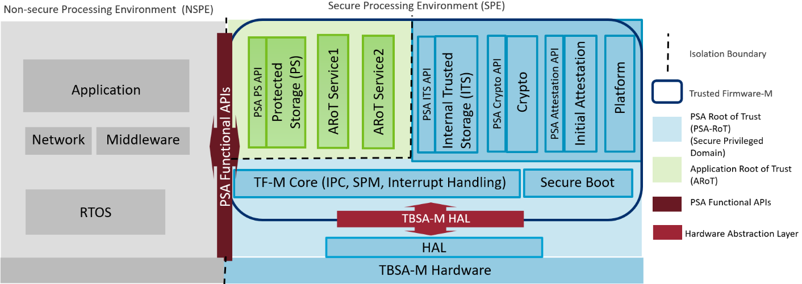

##################
Trusted Firmware M
##################

Trusted Firmware-M (TF-M) implements the Secure Processing Environment (SPE)
for Armv8-M, Armv8.1-M architectures (e.g. the `Cortex-M33`_, `Cortex-M23`_,
`Cortex-M55`_ processors) or dual-core platforms.It is the platform security
architecture  reference implementation aligning with PSA Certified guidelines,
enabling chips,Real Time Operating Systems and devices to become PSA Certified.

TF-M relies on an isolation boundary between the Non-secure Processing
Environment (NSPE) and the Secure Processing Environment (SPE). It can but is
not limited to using the `Arm TrustZone technology`_ on Armv8-M and Armv8.1-M
architectures. In pre-Armv8-M architectures physical core isolation is required.

**Trusted Firmware-M consists of:**

- Secure Boot to authenticate integrity of NSPE and SPE images
- TF-M Core responsible for controlling the isolation, communication and
  execution within SPE and with NSPE
- Crypto, Internal Trusted Storage (ITS), Protected Storage (PS) and
  Attestation secure services

   FF-M compliant design with TF-M

Applications and Libraries in the Non-secure Processing Environment can
utilize these secure services with a standardized set of PSA Functional APIs.
Applications running on Cortex-M devices can leverage TF-M services to ensure
secure connection with edge gateways and IoT cloud services. It also protects
the critical security assets such as sensitive data, keys and certificates on
the platform. TF-M is supported on several Cortex-M based
:doc:`Microcontrollers </platform/ext/index>` and Real Time Operating
Systems (RTOS).

Terms ``TFM`` and ``TF-M`` are commonly used in documents and code and both
refer to ``Trusted Firmware M.`` :doc:`Glossary </docs/reference/glossary>`
has the list of terms and abbreviations.

#######
License
#######
The software is provided under a BSD-3-Clause :doc:`License </docs/contributing/lic>`.
Contributions to this project are accepted under the same license with developer
sign-off as described in the :doc:`Contributing Guidelines </docs/contributing/contributing>`.

This project contains code from other projects as listed below. The code from
external projects is limited to ``app``, ``bl2``, ``lib`` and ``platform``
folders. The original license text is included in those source files.

- The ``app`` folder contains files imported from CMSIS_5 project and the files
  have Apache 2.0 license.
- The ``bl2`` folder contains files imported from MCUBoot project and the files
  have Apache 2.0 license.
- The ``lib`` folder may contain 3rd party files with diverse licenses.
- The ``platform`` folder currently contains platforms support imported from
  the external project and the files may have different licenses.

#########################
Release Notes and Process
#########################
The :doc:`Release Cadence and Process </docs/contributing/release_process>` provides
release cadence and process information.

The :doc:`Change Log & Release Notes </docs/reference/changelog>` provides details of
major features of the release and platforms supported.

###############
Getting Started
###############

************
Prerequisite
************
Trusted Firmware M provides a reference implementation of platform security
architecture  reference implementation aligning with PSA Certified guidelines.
It is assumed that the reader is familiar with specifications can be found at
`Platform Security Architecture Resources <https://developer.arm.com/architectures/security-architectures/platform-security-architecture>`__.

The current TF-M implementation specifically targets TrustZone for ARMv8-M so a
good understanding of the v8-M architecture is also necessary. A good place to
get started with ARMv8-M is
`developer.arm.com <https://developer.arm.com/architectures/cpu-architecture/m-profile>`__.

**********************
Really getting started
**********************
Trusted Firmware M source code is available on
`git.trustedfirmware.org <https://git.trustedfirmware.org/TF-M/trusted-firmware-m.git/>`__.

To build & run TF-M:

    - Follow the :doc:`SW requirements guide </docs/getting_started/tfm_sw_requirement>`
      to set up your environment.
    - Follow the
      :doc:`Build instructions </docs/getting_started/tfm_build_instruction>` to compile
      and build the TF-M source.
    - Follow the :doc:`User guide </docs/getting_started/tfm_user_guide>` for information
      on running the example.

To port TF-M to a another system or OS, follow the
:doc:`OS Integration Guide </docs/getting_started/tfm_integration_guide>`

Please also see the :doc:`glossary </docs/reference/glossary>` of terms used in the project.

:doc:`Contributing Guidelines </docs/contributing/contributing>` contains guidance on how to
contribute to this project.

Further documents can be found in the ``docs`` folder.

###################
Platforms supported
###################
    - Cortex-M55 system:

        - `FPGA image loaded on MPS3 board (AN547).
          <https://developer.arm.com/products/system-design/development-boards/cortex-m-prototyping-systems/mps3>`_
        - `Fast model FVP_SSE300_MPS2.
          <https://developer.arm.com/tools-and-software/open-source-software/arm-platforms-software/arm-ecosystem-fvps>`_

    - Cortex-M33 system:

        - `FPGA image loaded on MPS2 board (AN521).
          <https://developer.arm.com/products/system-design/development-boards/cortex-m-prototyping-systems/mps2>`_
        - `Fast model FVP_MPS2_AEMv8M (AN521).
          <https://developer.arm.com/products/system-design/fixed-virtual-platforms>`_
        - `Musca-A test chip board.
          <https://developer.arm.com/products/system-design/development-boards/iot-test-chips-and-boards/musca-a-test-chip-board>`_
        - `Musca-B1 test chip board.
          <https://developer.arm.com/products/system-design/development-boards/iot-test-chips-and-boards/musca-b-test-chip-board>`_
        - `Musca-S1 test chip board.
          <https://developer.arm.com/tools-and-software/development-boards/iot-test-chips-and-boards/musca-s1-test-chip-board>`_
        - `FPGA image loaded on MPS3 board (AN524).
          <https://developer.arm.com/tools-and-software/development-boards/fpga-prototyping-boards/mps3>`_
        - `LPC55S69.
          <https://www.nxp.com/products/processors-and-microcontrollers/arm-microcontrollers/general-purpose-mcus/lpc5500-cortex-m33/lpcxpresso55s69-development-board:LPC55S69-EVK>`_
        - `NUCLEO L552ZE Q.
          <https://www.st.com/content/st_com/en/products/evaluation-tools/product-evaluation-tools/mcu-mpu-eval-tools/stm32-mcu-mpu-eval-tools/stm32-nucleo-boards/nucleo-l552ze-q.html>`_
        - `DISCO L562QE.
          <https://www.st.com/content/st_com/en/products/evaluation-tools/product-evaluation-tools/mcu-mpu-eval-tools/stm32-mcu-mpu-eval-tools/stm32-discovery-kits/stm32l562e-dk.html>`_
        - `nRF9160 DK (nordic_nrf/nrf9160dk_nrf9160).
          <https://www.nordicsemi.com/Software-and-tools/Development-Kits/nRF9160-DK>`_
        - `nRF5340 PDK (nordic_nrf/nrf5340pdk_nrf5340_cpuapp).
          <https://www.nordicsemi.com/Software-and-tools/Development-Kits/nRF5340-PDK>`_
        - `nRF5340 DK (nordic_nrf/nrf5340dk_nrf5340_cpuapp).
          <https://www.nordicsemi.com/Software-and-tools/Development-Kits/nRF5340-PDK>`_

    - Cortex-M23 system:

        - `FPGA image loaded on MPS2 board (AN519).
          <https://developer.arm.com/products/system-design/development-boards/cortex-m-prototyping-systems/mps2>`_
        - `M2351.
          <https://www.nuvoton.com/products/iot-solution/iot-platform/numaker-pfm-m2351/>`_

    - Dual Core Cortex-M system:

        - `PSoc64.
          <https://www.cypress.com/documentation/product-brochures/cypress-psoc-64-secure-microcontrollers>`_

    - Secure Enclave system:

        - :doc:`Musca-B1 Secure Enclave. </platform/ext/target/musca_b1/secure_enclave/readme>`

The document :doc:`Platform Deprecation and Removal </docs/contributing/platform_deprecation>`
lists the deprecated platforms planned to be removed from upstream.

####################
Feedback and support
####################
For this release, feedback is requested via email to
`tf-m@lists.trustedfirmware.org <tf-m@lists.trustedfirmware.org>`__.

###############
Version history
###############
+-------------+--------------+--------------------+-------------------+
| Version     | Date         | Description        | PSA-arch tag/hash |
+=============+==============+====================+===================+
| v1.0-beta   | 2019-02-15   | 1.0-beta release   |       -           |
+-------------+--------------+--------------------+-------------------+
| v1.0-RC1    | 2019-05-31   | 1.0-RC1 release    | v19.06_API0.9     |
+-------------+--------------+--------------------+-------------------+
| v1.0-RC2    | 2019-10-09   | 1.0-RC2 release    | v19.06_API0.9     |
+-------------+--------------+--------------------+-------------------+
| v1.0-RC3    | 2019-11-29   | 1.0-RC3 release    | v19.06_API0.9     |
+-------------+--------------+--------------------+-------------------+
| v1.0        | 2020-03-27   | 1.0 release        | v20.03_API1.0     |
+-------------+--------------+--------------------+-------------------+
| v1.1        | 2020-07-15   | 1.1 release        | 1f960947          |
+-------------+--------------+--------------------+-------------------+
| v1.2.0      | 2020-11-25   | 1.2.0 release      | 90c8e680          |
+-------------+--------------+--------------------+-------------------+
| v1.3.0      | 2021-04-07   | 1.3.0 release      | b0635d9           |
+-------------+--------------+--------------------+-------------------+

Please refer to
:ref:`docs/contributing/release_process:Release Version Scheme` for interpreting
version numbers.

.. _Cortex-M33: https://developer.arm.com/ip-products/processors/cortex-m/cortex-m33
.. _Cortex-M23: https://developer.arm.com/ip-products/processors/cortex-m/cortex-m23
.. _Cortex-M55: https://developer.arm.com/ip-products/processors/cortex-m/cortex-m55
.. _PSA Certified: https://www.psacertified.org/about/developing-psa-certified/
.. _Arm TrustZone technology: https://developer.arm.com/ip-products/security-ip/trustzone/trustzone-for-cortex-m

--------------

*Copyright (c) 2017-2021, Arm Limited. All rights reserved.*
