

# <mark>LPBAM utility getting started</mark>
Copyright &copy; 2021 STMicroelectronics\

{.logo}

::: {.row}
::: {.collapse}
<input type="checkbox" id="collapse-section1" checked aria-hidden="true">
<label for="collapse-section1" aria-hidden="true">LPBAM introduction</label>

# LPBAM introduction  

## 1. Overview  

::: {.row}
::: {.col-sm-12 .col-lg-6}
-   **Naming**  
    -   **LPBAM**: **L**ow **P**ower **B**ackground **A**utonomous **M**ode

-   **Definition**  
    -   LPBAM is an operating mode that allows peripherals to be functional and autonomous independently from power modes and without any software running. It is performed thanks to a hardware subsystem  embedded in the STM32 microcontroller.  
    -   The LPBAM subsystem can chain various operations thanks to DMA linked-list transfers. The DMA operations can be:    
        - Autonomous peripheral configuration  
        - Data transfer from / to autonomous peripherals  
    -   Optionally, the LPBAM subsystem can generate asynchronous events / interrupts that can be used to:  
        - notify the system at the end of a subprocess or of the whole process (for example chaining another task),  
        - wake up the system from low-power mode,  
        - notify the system when a functional error occurred while an LPBAM task was running.  

-   **Benefits** 
    -   Two major advantages result from using LPBAM subsystem mechanisms:  
        - Power consumption is optimized:  
            - Bus and kernel clocks are distributed only when needed.  
            - Most of the product can be shut down.  
            - Analog peripherals / oscillators are powered on only when necessary.  
        - CPU bandwidth is offloaded:  
            - Peripheral configurations are done by DMA instead of CPU.  
            - Data transfers are done by DMA instead of CPU.  
:::

::: {.col-sm-12 .col-lg-6}

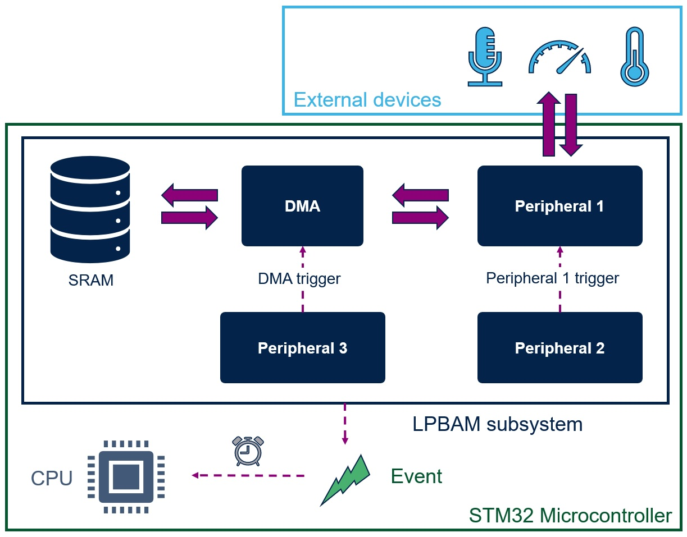{ width=60% }  

:::
:::

## 2. Principles  

::: {.row}
::: {.col-sm-12 .col-lg-6}
-   **Sequence of operations**  
Thanks to DMA transfers (memory-to-memory, peripheral-to-memory and memory-to-peripheral) in Linked-list mode, the LPBAM subsystem can chain different actions to build a useful functionality (peripheral configurations and transfers).

-   **Actions handled by DMA**  
DMA transfers can handle three different actions according to configuration setup:
    -   Configuration transfers (DMA memory-to-memory direction)
    -   Data transfers (DMA memory-to-peripheral or peripheral-to-memory direction)
    -   Clear flag transfers (DMA memory-to-memory direction)

-   **Hardware signals**  
The LPBAM subsystem operates without any CPU intervention. As a result, polling a peripheral flag and conditioning a peripheral start are not possible. Most autonomous peripherals come with a set of synchronous and asynchronous hardware signals meant to ensure the synchronization between LPBAM subsystem contributors.  
These signals can be the following:  
    -   DMA requests:  
    Hardware signals sent by the peripheral to notify the DMA that ready data are available or new data can be retrieved.  

    -   DMA triggers:  
    Hardware signals sent by the DMA to:  
        - a peripheral to condition a start operation, or  
        - another DMA instance to condition the next transfer.  

    -   Peripheral triggers:  
    Hardware signals sent by the peripheral to:  
        - a DMA channel to condition the next transfer, or  
        - another peripheral to condition a start operation.  

It is possible to mix requests and trigger signals to perform advanced use case scenario.  
:::

::: {.col-sm-12 .col-lg-6}
-   **LPBAM tasks**  
Depending on the use case scenario, an LPBAM task can be linear or circular:
    -   Linear task:  
    Executed in a fixed period of time and stops autonomously.  

    -   Circular task:  
    Executed in an infinite loop and stops only by aborting the DMA operation.  
:::
:::

:::

::: {.collapse}
<input type="checkbox" id="collapse-section2" checked aria-hidden="true">
<label for="collapse-section2" aria-hidden="true">LPBAM features</label>

# LPBAM features  

## 1. Linked-list mode  
::: {.row}
::: {.col-sm-12 .col-lg-6}
-   The linked-list capability allows the DMA peripheral to chain a list of DMA transfers.  
Each DMA transfer has its own configuration stored in an SRAM area named node.  
Each node is linked to another node to define the next transfer configuration.  
A set of DMA transfer nodes linked to each other builds a queue.  
-   When started, the DMA channel fetches the first linked-list node from SRAM (known as head node).  
When executed, the next linked list node is fetched and executed.  
This operation is repeated until the last queue node (known as tail node) is executed.  
-   When the linked-list queue is circular, the DMA repeats node execution in an infinite loop (from the first circular nodes to tail node).  
-   This feature is used to chain elementary DMA transfers (Configuration transfers, Data transfers and Clear flag transfers) to perform an LPBAM task.  
-   The linked-list feature is functional independently from power mode. It enables the chaining of DMA transfers when devices are in low-power mode.
:::

::: {.col-sm-12 .col-lg-6}

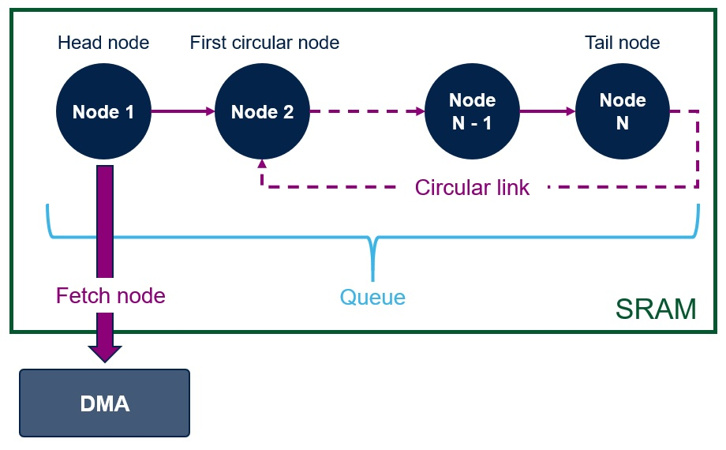{ width=60% }  

:::
:::

## 2. Bus clock requests  
::: {.row}
::: {.col-sm-12 .col-lg-12}
-   Several peripherals operate thanks to a bus clock propagated through a device interconnect structure (for example DMA peripherals). To limit clock availability according to peripheral operation, these peripherals support bus clock requesting capability.  
-   When an LPBAM subsystem in low-power mode is not active, the bus clock is released to reduce power consumption.  
When it is active, the bus clock is maintained until the operation completes, and then released.  
:::
:::

## 3. Kernel clock requests  
::: {.row}
::: {.col-sm-12 .col-lg-12}
-   Similarly as bus clock, the kernel clock is requested and released according to peripheral operation. 
-   While in idle state, the peripheral releases the kernel clock. Otherwise, it is requested and maintained until the current task completes.  
:::
:::

## 4. Automatic start  
::: {.row}
::: {.col-sm-12 .col-lg-12}
-   Several peripherals can start operating autonomously thanks to their sensitivity to trigger signals.  
-   Each peripheral, depending on its application use cases, can be triggered by a set of signals that can define the starting time.  
:::
:::

## 5. Event / Interrupt generation  
::: {.row}
::: {.col-sm-12 .col-lg-12}
-   Autonomous peripherals can report end-of-operation and errors via events (through the EXTI peripheral) or interrupts (through the NVIC).  
-   This capability can be used to: 
    -   wake up the whole system from low-power mode.
    -   notify the system about error events / interrupts handling.
    -   notify the system about end-of-operation event / interrupt handling.  
:::
:::

:::

::: {.collapse}
<input type="checkbox" id="collapse-section3" checked aria-hidden="true">
<label for="collapse-section3" aria-hidden="true">LPBAM firmware solution</label>

# LPBAM firmware solution  

## 1. Overview  
::: {.row}
::: {.col-sm-12 .col-lg-12}
-   The LPBAM utility is a set of modular drivers located under the <i>Utilities</i> folder of the STM32Cube firmware package.  
It provides the user with two levels of abstraction:  
    -   Basic level.  
    -   Advanced level.  
:::
:::

::: {.row}
::: {.col-sm-12 .col-lg-6}
-   **Layers**  
    -   The first level of abstraction is a hardware agnostic layer, named Basic LPBAM layer.  
    It offers a full granularity of scenario creation via transversal APIs.  
    -   The second level of abstraction is a hardware agnostic layer named Advanced LPBAM layer.  
    It provides predefined scenario (set of elementary nodes) that can be customized and concatenated to build an end-application.  
    -   The Platform layer contains device specific constants to be used on application side.  
    -   The low-level LPBAM layer (LL LPBAM layer) is used by the Basic and the Advanced LPBAM layers. It contains the device specific mechanisms for each supported peripheral.
:::

::: {.col-sm-12 .col-lg-6}

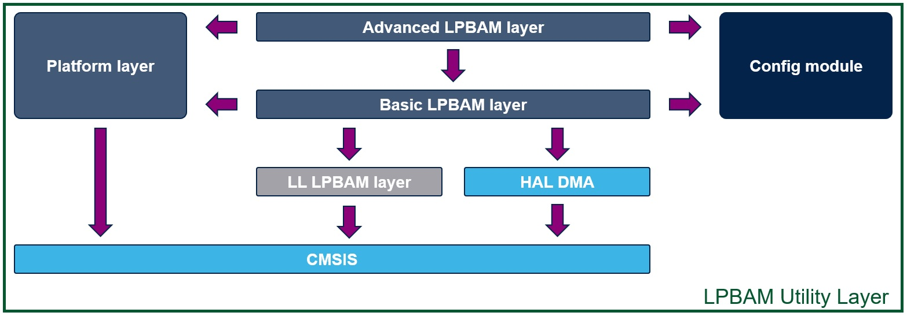{ width=80% }  

:::
:::

::: {.row}
::: {.col-sm-12 .col-lg-6}
-   **Modularity**  
    -   The LPBAM utility contains a set of independent modules, each module being a pair of basic and advanced files that provides the APIs needed to build application scenario.  
    The files are named as follows:
        - Basic module: stm32_lpbam_{Peripheral}.c / stm32_lpbam_{Peripheral}.h.  
        - Advanced module: stm32_adv_lpbam_{Peripheral}.c / stm32_adv_lpbam_{Peripheral}.h.  
    -   Each module manages the configurability and the data transfers for a given peripheral.  

-   **Configurability**  
    -   The LPBAM utility is designed to be compatible with any STM32 devices supporting LPBAM subsystem mechanisms through a configuration module. The configuration file is named stm32_lpbam_conf_template.h. 
    -   The configuration file must be copied to the application folder, renamed into stm32_lpbam_conf.h, and modified according to application needs. 

-   **Inclusion model and entry point**  
    -   The LPBAM utility has a single application entry point: stm32_lpbam.h file.  
    -   The user has to include the stm32_lpbam.h file in her/his LPBAM software project that includes all basic, advanced, platform and common functionalities.  

-   **Flexibility**  
    -   The LPBAM utility gives the full flexibility to use only Basic layer, only Advanced layer or to mix Basic and Advanced functionalities in the same application.  
    When an LPBAM module is enabled, the application entry point allows basic and advanced functionalities of used module to be included.  

-   **Status mechanism**  
    -   The LPBAM utility contains a common status mechanism that reports the issues detected during scenario creation.  
    The values reported can be:  
        - LPBAM_OK: no error occurred.  
        - LPBAM_ERROR: an error occurred.  
        - LPBAM_INVALID_ID: the chosen node ID is not valid.  
:::

::: {.col-sm-12 .col-lg-6}

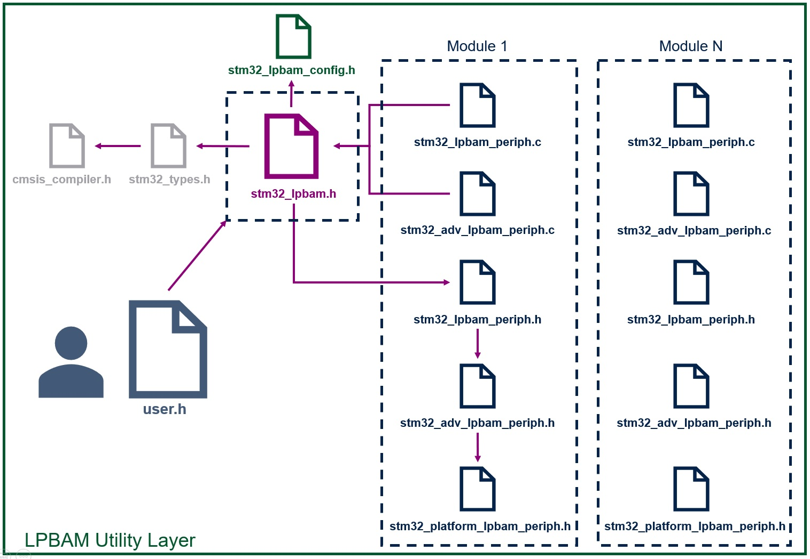{ width=80% }  

:::
:::

## 2. Basic layer

::: {.row}
::: {.col-sm-12 .col-lg-12}
-   **Principles**  
    The Basic layer is designed to manage LPBAM functionalities at node level (elementary entity). The principle is to prepare and fill a DMA node according to the user configuration structure that describes the DMA transfer to be started.  
:::
:::

::: {.row}
::: {.col-sm-12 .col-lg-12}
-   **API model**  
    Each LPBAM basic module provides an LPBAM_{Peripheral}_FillNodeConfig() API that respects the prototype shown in the figure below:

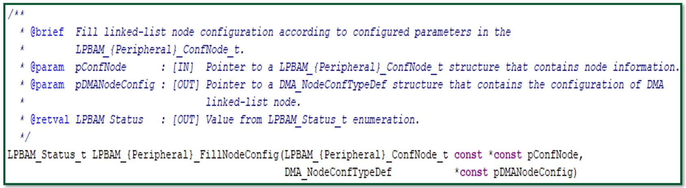{ width=60% }  

:::
:::

::: {.row}
::: {.col-sm-12 .col-lg-12}
-   **Data transfer configuration common service**  
    -   Update DMA transfer node configuration  
        After building a DMA linked-list node with default configuration values, customizing the default configuration can be done through LPBAM_SetDMATransferConfig() API.  

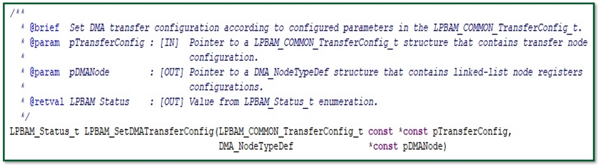{ width=60% }  

:::
:::

::: {.row}
::: {.col-sm-12 .col-lg-12}
-   **Trigger configuration common service**  
    -   Update DMA trigger node configuration  
        After building a DMA linked-list node with default configuration values (no trigger), customizing the default configuration can be done through
        LPBAM_SetDMATriggerConfig() API.  

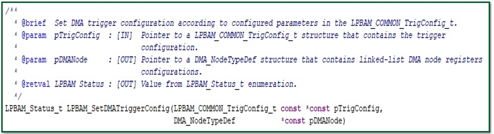{ width=60% }  

:::
:::

::: {.row}
::: {.col-sm-12 .col-lg-12}
-   **User sequence**  
    -   The user sequence is based on three steps:
        - Peripheral initialization  
        - Scenario build  
        - Scenario start  
    -   Each of these steps is based on mandatory tasks and optional ones.

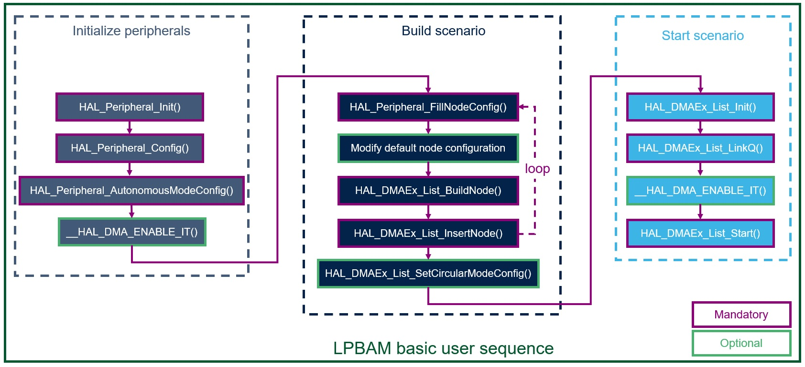{ width=60% }  

:::
:::

## 3. Advanced layer

::: {.row}
::: {.col-sm-12 .col-lg-12}
-   **Principles**  
    The advanced layer is designed to manage LPBAM functionalities at queue level.  
    The principle is to prepare, fill, then build a DMA linked-list queue according to the user configuration structure that describes the peripheral operation and behavior to be performed.  

-   **API model**  
    Three models of APIs are systematically provided by an advanced LPBAM module for a given peripheral:  

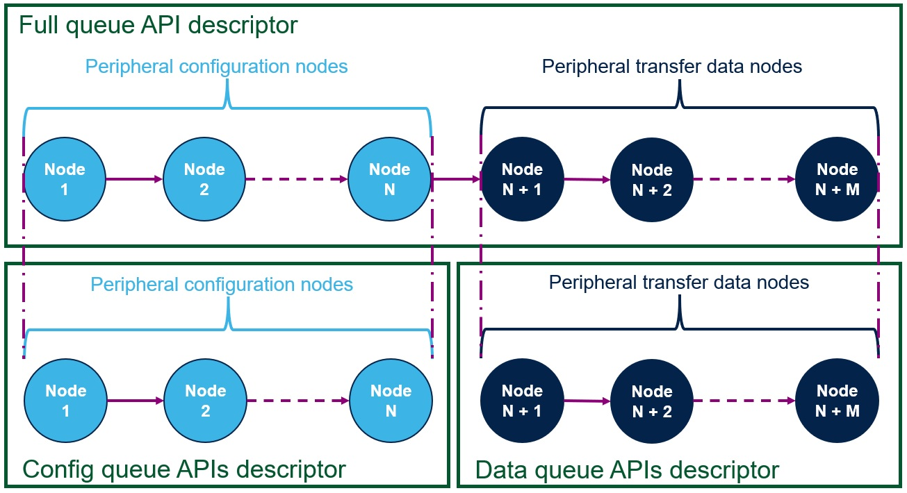{ width=40% }  

    -   **Configuration APIs**  
    Set of APIs that contains only peripheral configuration nodes (no data nodes). These APIs are used to update the peripheral configuration for next operation.  

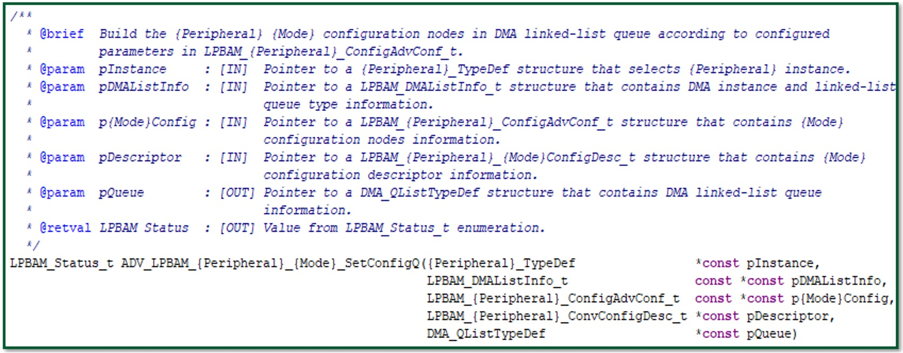{ width=60% }  

    -   **Data APIs**  
    Set of APIs that contains only peripheral data nodes (transmit data, convert data). These APIs are used to process data for next operation.  

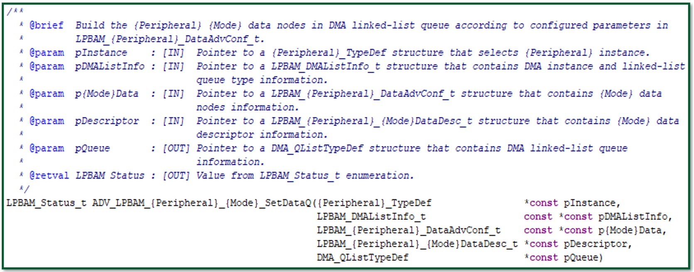{ width=60% }  

    -   **Full APIs**  
    Set of APIs that contains both peripheral configuration and peripheral data nodes. These APIs are used to update the peripheral configuration, then process data for next operation.  

{ width=60% }  

-   **API exceptions**  
    _APIs supporting peripheral features:_  
    -   The three API model rules can be transgressed:   
        - Only full prototype APIs are provided for peripherals that do not support data nodes or configuration nodes (such as VREFBUF or GPIO).  
    -   Full-duplex APIs  
        - Advanced LPBAM APIs have only one output queue as configuration, and data transfer are performed sequentially at runtime.  
        Exception is made for peripherals supporting full-duplex transfers (synchronous protocol) requiring two output queues that reflect the transmit and receive processes performed simultaneously (such as SPI).  
    -   DMA requests APIs  
        - Helper API called at peripheral initialization level to enable peripheral DMA requests. This API should be used for modules that generate DMA requests during data transfers.

    _APIs customizing default queue configuration:_

    -   Update data transfer configuration  
        - After building a DMA linked-list queue with default configuration values, customizing the default data node configuration can be done through ADV_LPBAM_Q_SetDataConfig() API.

{ width=60% }  

    -   Update queue trigger configuration  
        - After building a DMA linked-list queue with default configuration values (no trigger), customizing the default configuration can be done through  
        ADV_LPBAM_Q_SetTriggerConfig() API. The trigger signal can be set to trigger the execution of an advanced API or can cadence a DMA data transfer.  

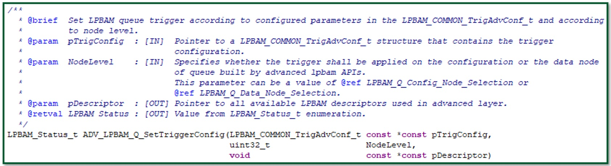{ width=60% }  

    -   Update queue circularity configuration  
        - After building a DMA linked-list queue with default configuration values (linear queue), circularizing the scenario queue configuration can be done 
		through ADV_LPBAM_Q_SetCircularMode() API.  

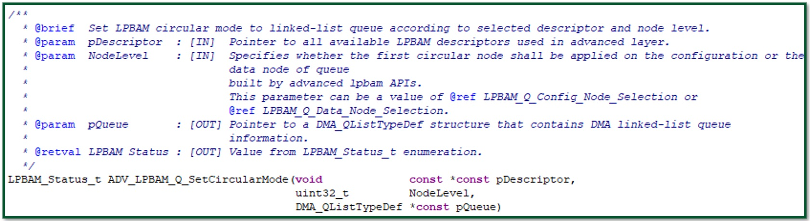{ width=60% }  

:::
:::

::: {.row}
::: {.col-sm-12 .col-lg-12}
-   **User sequence**  
    -   The user sequence is based on three steps:
        - Peripheral initialization  
        - Scenario build  
        - Scenario start  
    -   Each of these steps are based on mandatory tasks and optional ones.

{ width=60% }  

:::
:::

:::

::: {.collapse}
<input type="checkbox" id="collapse-section4" checked aria-hidden="true">
<label for="collapse-section4" aria-hidden="true">LPBAM applications</label>

# LPBAM applications  

## 1. Typical use cases  

::: {.row}
::: {.col-sm-12 .col-lg-6}
-   **Communication peripherals**  
    -   I2C slave reception or transmission, SPI reception, UART reception  
        - Wakeup is possible at the end of the transfer, at DMA half buffer event.  
    -   I2C master transfer, SPI / UART transmission, triggered by asynchronous event  
        - Asynchronous triggers can be an I/O edge, or a periodic trigger from LPTIM or comparator output.  

-   **Analog peripherals**  
    -   ADC or DAC sequence of conversions triggered by low-power timer (or any trigger)  
        - Wakeup possible from ADC analog watchdog (conversion result out of programmed thresholds)  
    -   Voice activity detection with MCU wake-up (thanks to ADF audio digital filter)  
        - Data transferred in SRAM during Stop mode  
    -   Change of comparator thresholds  
:::

::: {.col-sm-12 .col-lg-6}
-   **System peripherals**  
    -   I/O control (input, output)  
        - to control external components  
        - to manage slow communications such as SPI protocol  
    -   Data transfer between SRAMs on trigger event  

-   **Timer peripherals**  
    -   Pulse counter  
        - LPDMA triggered periodically to store in SRAM the value of an LPTIM counter clocked by an I/O.  
    -   Input Capture DMA transfers  
    -   PWM ratio update in Stop mode  
:::
:::

## 2. Getting started
::: {.row}
::: {.col-sm-12 .col-lg-12}

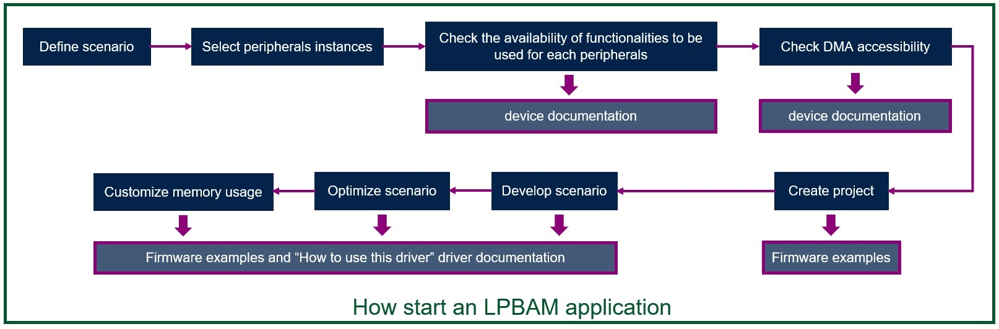{ width=60% }  

:::
:::

:::

::: {.collapse}
<input type="checkbox" id="collapse-section5" checked aria-hidden="true">
<label for="collapse-section5" aria-hidden="true">Product specificities</label>

# Product specificities

## 1. DMA accessibility  
-   According to STM32 peripheral integration and power domain definition:  
    -   DMA can access only to a reduced memory range. This DMA integration strategy must be took into consideration when building an LPBAM application.  

## 2. Memory usage  
-   Generally, low-power STM32 lines embed memories of limited size that shall be managed with optimum memory usage.  
-   The LPBAM utility includes two types of variables:  
    - Variables used by the program executed by CPU. They can be placed at any available SRAM address.  
    - Variables used by the DMA in order to execute linked-list queue. They must be placed at SRAM addresses accessible by the DMA instance. These variables are LPBAM descriptors and data buffers.  
        => To optimize memory usage, it is recommended to place only the variables used during linked-list queue execution in the SRAM accessible by the DMA instance used within the LPBAM application.  

## 3. TrustZone® compliance  
-   The LPBAM software solution is compliant with TrustZone software architecture.  
-   As the DMA is a TrustZone-aware peripheral, configuring the source and the destination access attributes are possible.  
-   In the basic layer, configuring DMA access attributes can be done at each node level.  
-   In the advanced layer, configuring DMA accesses attributes is possible only for the data nodes where the user can perform data transfer as follows:  
    - from secure to secure addresses.  
    - from secure to non-secure addresses.  
    - from non-secure to secure addresses.  
    - from non-secure to non-secure addresses.  

:::

::: {.collapse}
<input type="checkbox" id="collapse-section5" checked aria-hidden="true">
<label for="collapse-section5" aria-hidden="true">FAQ</label>

## FAQ  

-   **What's an LPBAM mechanism ?**  
    -   The LPBAM mechanism is a subsystem that operates independently from low power mode and without any software running (CPU intervention). The low power mode depends on products integration.  

-   **Does LPBAM layer suppose that the peripheral is already initialized and do only partial configuration or performs a full initialization ?**  
    -   The LPBAM layer targets only partial reconfiguration.  

-   **Is the LPBAM based on DMA "tasks" used to configure the peripherals ?**  
    -   The LPBAM is based on DMA transfers stored on linked-list nodes to configure partially autonomous peripherals.  

-   **How are managed the peripheral errors in LPBAM ?**  
    -   The peripheral errors can generate interrupts that wake up the system for issue recovery.  

-   **How is the DMA triggered if there is neither peripheral nor CPU running ?**  
    -   DMA triggers are hardware generated signals.  

-   **Are we able to handle timeout with LPBAM ?**  
    -   Yes. A timeout can be emulated by the LPTIM compare match feature. When the selected counter value is reached, a timeout event can be generated.  

-   **where is stored the LPBAM configuration ?**  
    -   The LPBAM configuration shall be stored in an accessible SRAM by the DMA to fetch configuration nodes and execute them.  

-   **Is the DMA used for LPBAM specific ?**  
    -   The LPBAM DMA shall support the linked-list feature and bus clock requests.  

-   **How are managed the priorities between LPBAM and others DMA transfer ?**  
    -   The LPBAM is based on DMA transfer,  the same DMA channels priority arbitration principle applies.  

-   **Does LPBAM node/queue number are limited ?**  
    -   Yes. The number of nodes and queues are limited by product SRAM size.  

-   **How many LPBAM transfer queue can be executed simultaneously ?**  
    -   The number of simultaneously executed of LPBAM transfer queue, is limited by the number of available DMA channels.  

:::

::: {.collapse}
<input type="checkbox" id="collapse-section5" checked aria-hidden="true">
<label for="collapse-section5" aria-hidden="true">Acronyms</label>

# Acronyms

| **Acronyms**     | **Definition**                                           |
| ---------------- | -------------------------------------------------------- |
| **CPU**          | **C**entral **P**rocessing **U**nit                      |
| **EXTI**         | **EXT**ended **I**nterrupts and event controller         |
| **NVIC**         | **N**ested **V**ectored **I**nterrupt **C**ontroller     |

:::

:::

<footer class="sticky">
For complete documentation on STM32,visit: [[www.st.com/stm32](http://www.st.com)]

This release note uses up to date web standards and, for this reason, should not be opened with Internet Explorer
but preferably with popular browsers such as Google Chrome, Mozilla Firefox, Opera or Microsoft Edge.
</footer>